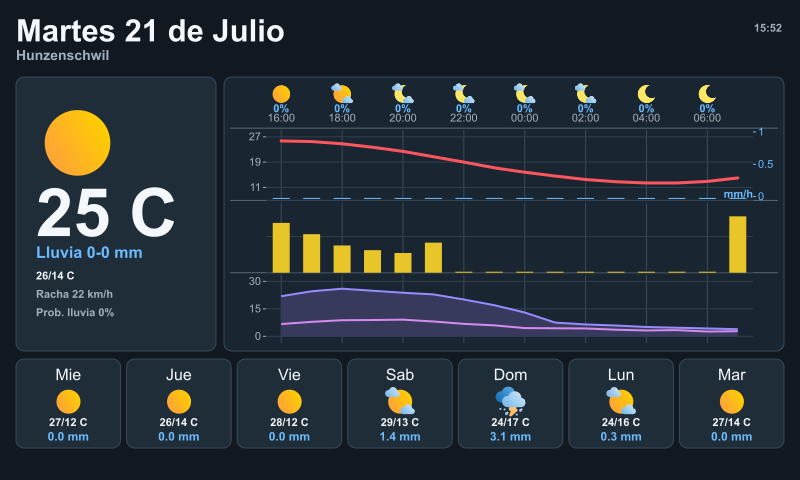

# InkyPi Backend

NestJS backend that turns MeteoSwiss local forecast data into PNG dashboards ready to be displayed on an InkyPi / Raspberry Pi e-paper setup.

The service exists so the display device can stay simple: instead of fetching weather data, parsing CSV files, merging forecast series, and rendering a layout locally, the Raspberry Pi can request one image URL and paint the returned PNG directly to the screen.

## Preview



## What It Does

- Fetches open MeteoSwiss local forecasting data from the Swiss geo.admin.ch STAC API.
- Resolves the configured forecast point, using Hunzenschwil as the built-in default.
- Aggregates hourly and daily weather parameters into a single JSON payload.
- Renders a compact weather dashboard as `image/png` using SVG plus Sharp.
- Includes current conditions, precipitation, temperature, sunshine, wind, gusts, daily forecast cards, refresh time, and optional battery status.
- Caches downloaded MeteoSwiss assets locally to keep requests fast and reduce external API traffic.

## How It Works

The backend downloads MeteoSwiss forecast metadata and parameter CSV files, filters them for the selected forecast point, and merges the relevant time series into a display-friendly model. The renderer then builds an SVG layout with bundled icons and fonts, converts it to PNG with Sharp, and returns it from the `/inkypi/meteoswiss/image` endpoint.

This keeps the display client intentionally lightweight. A Raspberry Pi can run a small polling script that calls the image endpoint at regular intervals and sends the PNG to the e-paper panel.

## Data Source

Weather data comes from the MeteoSwiss open government data local forecasting collection exposed through the Swiss geo.admin.ch STAC API:

```text
https://data.geo.admin.ch/api/stac/v1/collections/ch.meteoschweiz.ogd-local-forecasting
```

## Endpoints

- `GET /health` returns the basic service status.
- `GET /inkypi/meteoswiss/weather` returns aggregated MeteoSwiss data.
- `GET /inkypi/meteoswiss/image` returns `image/png` with the rendered dashboard.
- `POST /inkypi/meteoswiss/battery` stores the latest battery status sent by the Raspberry Pi.

## Quick Start

Requirements:

- Node.js 20 or newer.
- npm.

Install dependencies and start the development server:

```bash
npm install
npm run start:dev
```

Generate a preview image:

```bash
curl "http://localhost:8010/inkypi/meteoswiss/image?width=800&height=480" --output meteoswiss.png
```

## Image Endpoint

```http
GET /inkypi/meteoswiss/image
```

Useful query parameters:

| Parameter | Description | Default |
| --- | --- | --- |
| `width` | Output PNG width. | `800` |
| `height` | Output PNG height. | `480` |
| `timezone` | Timezone used for labels and forecast grouping. | `Europe/Zurich` |
| `latitude` / `longitude` | Coordinates used to find the nearest MeteoSwiss point. | Hunzenschwil coordinates |
| `pointId` / `pointTypeId` | Explicit MeteoSwiss forecast point identifiers. | Built-in Hunzenschwil point |
| `forecastDays` | Number of daily forecast entries to prepare. | `7` |
| `displayRefreshTime` | Show or hide the refresh time. | `true` |
| `displayBattery` | Show or hide battery status. | `true` |
| `backgroundColor` | Dashboard background color. | `#111820` |
| `textColor` | Primary text color. | `#f4f7fb` |
| `accentColor` | Temperature line accent color. | `#ff5a52` |

Example:

```bash
curl "http://localhost:8010/inkypi/meteoswiss/image?width=800&height=480&timezone=Europe/Zurich" --output meteoswiss.png
```

## Battery Status

The display device can report its latest battery reading to the backend:

```bash
curl -X POST "http://localhost:8010/inkypi/meteoswiss/battery" \
  -H "Content-Type: application/json" \
  -d '{"vin":3.91,"charging":false}'
```

It also accepts `percent` if the Raspberry Pi already calculates it:

```bash
curl -X POST "http://localhost:8010/inkypi/meteoswiss/battery" \
  -H "Content-Type: application/json" \
  -d '{"vin":3.91,"percent":58,"charging":false}'
```

If `percent` is not provided, the service estimates a LiPo percentage from the reported voltage. The latest battery status is stored in the configured cache path and can be rendered into the dashboard.

## Configuration

Copy `.env.example` or provide the same variables in your runtime environment.

Environment variables:

| Variable | Description | Default |
| --- | --- | --- |
| `PORT` | HTTP port. | `8010` |
| `INKYPI_DEFAULT_WIDTH` | Default image width. | `800` |
| `INKYPI_DEFAULT_HEIGHT` | Default image height. | `480` |
| `INKYPI_TIMEZONE` | Default timezone. | `Europe/Zurich` |
| `INKYPI_CACHE_DIR` | Cache directory for MeteoSwiss files and filtered data. | `data/cache` |
| `INKYPI_BATTERY_STATUS_PATH` | Battery JSON file path. | `data/cache/battery.json` |
| `INKYPI_ASSETS_DIR` | Directory containing fonts and weather icons. | `assets` |

## Docker

```bash
docker compose up -d --build
```

The Docker image builds the NestJS app, installs the runtime dependencies required by Sharp/font rendering, and mounts a named volume for the cache.

## Project Structure

- `src/inkypi/meteoswiss.service.ts` fetches, filters, caches, and aggregates MeteoSwiss data.
- `src/inkypi/meteoswiss.renderer.ts` renders the dashboard SVG and converts it to PNG.
- `src/inkypi/meteoswiss.controller.ts` exposes the weather, image, and battery endpoints.
- `assets/` contains bundled fonts and weather icons used by the renderer.
- `data/layout-previews/` contains generated preview images for documentation and layout checks.

## Notes

- The project includes the required icons and fonts in `assets/`.
- The current dashboard layout uses Spanish date and short day labels.
